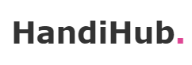

<br>
#  Hi
Welcome to Handi-Hub project

##  How to run
> [!IMPORTANT]
> **Run the** `src/main/handihub-docker/postgres.yml` **and** `src/main/handihub-docker/keycloak.yml` **docker compose files.**
> **After it run main java class**

##  Todo
- [x] Liquibase is added
- [x] Product, Comment and Content(for storing photos, videos of products) entities is created. Migrated to liquibase
- [x] Should create APIs for added photos
- [x] Should add Swagger
- [x] Should add roles and attach they to groups in `src/handihub-docker/realm-config/dev-realm.json`
- [x] Keycloak integrated to Google. Sign up/in with Google is available
- [ ] Should create APIs for added comments
- [ ] Should create APIs for Cart CRUD
- [ ] Should write more test cases for ordering products
- [ ] Should create API which fetches products of seller

##  APIs
**Swagger is enable on hosts:**
1. https://localhost:8080/v3/api-docs - <span style="color: green">Returns APIs as JSON</span>
2. https://localhost:8080/swagger-ui/index.html - <span style="color: green">Returns Swagger UI page. And search `/v3/api-docs` in explorer</span>

> [!IMPORTANT]
> **Run the application locally before request to Swagger endpoints** 

##  Integrating Keycloak IDP with Google

This repository contains a sample configuration for integrating **Keycloak Identity Provider (IDP)** with **Google**.

###  Integration Instructions

Keycloak is already integrated with Google, and you can learn how to do it by following this [link](https://keycloakthemes.com/blog/how-to-setup-sign-in-with-google-using-keycloak).

###  Configuration

For convenience, the configuration is already written in the [`dev-realm.json`](https://github.com/thesardorbroo/handi-hub/blob/master/src/main/handihub-docker/realm-config/dev-realm.json) file.

###  Testing

**To test the integration, use the following links:**

> [!IMPORTANT]
> You can get template of URI
> <details>
> <summary>Template of URI</summary>
> 
> ```curl
> ${Keycloak base URL}/realms/${Keycloak realm name}/protocol/openid-connect/auth?client_id=${Keycloak client ID}&redirect_uri=${Keycloak redirect URI}&response_type=code&scope=openid&kc_idp_hint=${Name of IDP}
> ```
> </details>

1. **For direct login through Google:**
    - [http://localhost:9080/realms/dev/protocol/openid-connect/auth?client_id=idp-client&redirect_uri=http://localhost:9080/realms/dev/broker/google/endpoint&response_type=code&scope=openid&kc_idp_hint=google](http://localhost:9080/realms/dev/protocol/openid-connect/auth?client_id=idp-client&redirect_uri=http://localhost:9080/realms/dev/broker/google/endpoint&response_type=code&scope=openid&kc_idp_hint=google)
    - This link directs the user to the Google login page.

2. **For login through the Keycloak UI and then redirect to Google via the Google icon:**
    - [http://localhost:9080/realms/dev/protocol/openid-connect/account](http://localhost:9080/realms/dev/protocol/openid-connect/account)
    - This link directs to the Keycloak UI, where you can click on the Google icon to login.

##  Team members

| Name | Profession | Specification |
| :-: | - | :-: |
| [Shorahimov Sardor](https://github.com/thesardorbroo) | Developer | Java BE |
| [Omonov Raxmatullo](https://github.com/Rakhmatullo1) | Developer | Java BE & Flutter |
